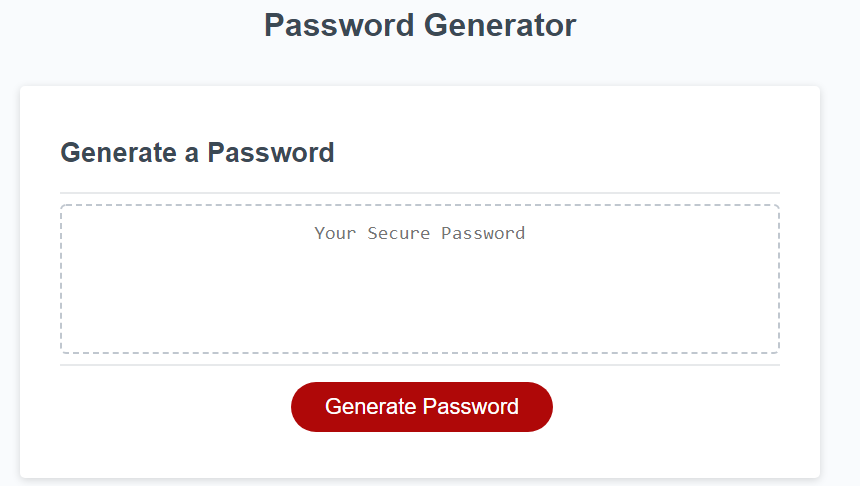
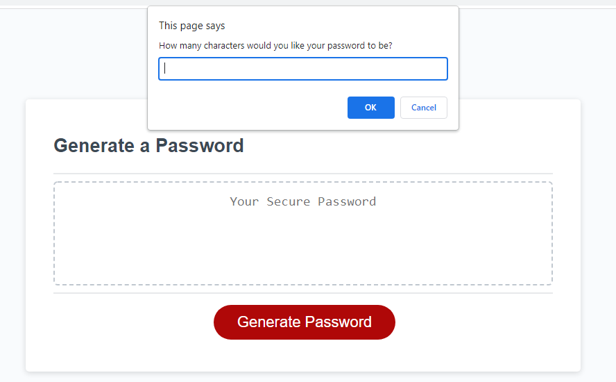
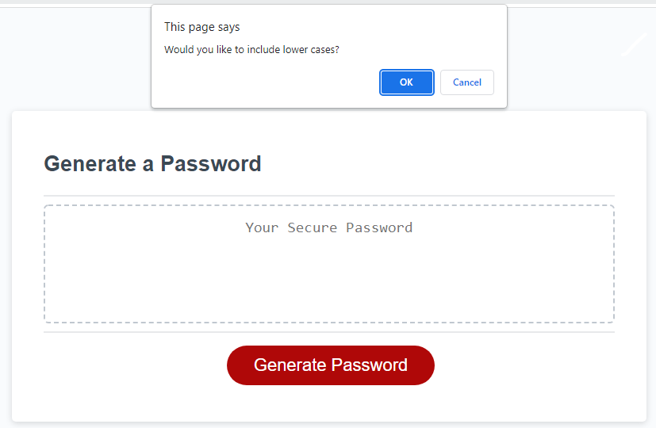
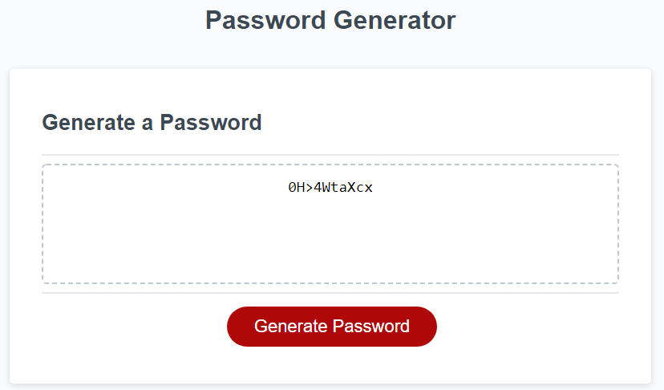

## Week 3 Homework

# Description

The main purpose of this project is to finish a random password generator that was started. The HTML, CSS, and part of the JavaScript (JS) file were provided.

Upon starting the unfinished .js, I knew that I want to create a function that will display a prmopt asking how many letters the users would like their passwords to be.

After that, I knew that there are certain requirements that the password needs to include: lower and upper cased alphabets, numerics, and symbols. After deciding the requirements, there needs to be a confirm for each conditional requirements asking the users if they would like to include each of the requirements.

By the time the password generator is finished, I will have applied some of the ideas such as the "for" loop, "if-else" statements, the "while" condition, creating an array, and writing "variables" and reference them to "functions". All of these will enable me to program the "Generate a Password" button, so that the users will be able to create a randomized password upon clicking on the button.

You can find the deployed link [here](https://yahplee.github.io/password-generator/).

# Installation

Looking at the conditions and requirments for the password, I knew that I had to start out with defining the variables that will go into a main password array (MPArray), where all the variables will be stored.

After that, upon clicking the button, the users will be greeted by a confirm tab, asking for the desired length of the password. To set a limit, the password must be between 8 to 128 characters. Anything less than 8 or more than 128 charcters will receive a statement reminding the users of the length requirement. To limit the number of characters, I had decided to use the "while" condition to set the limit of the characters and an "if" statement to warn the user to enter a length.

After setting the length limit, the next part comes the conditions for the password: Should the password include lower cases, upper cases, numerics, and/or symbols? I thought that each requirement is a yes-or-no statement, or a boulean (true or false), so I decided to use a window.confirm function. However, with each Yes and No, there needs to be a condition for both answers. Here, I have used the "if-else" statment to fit both Yes and No. If the users choose Yes for the conditions, then the respective conditions will be pushed up to the MPArray. If No is chosen, then the conditions will not be pushed up to the MPArray.

Now that all of the conditions have been fulfilled, I need to write a function to allow the JS to randomize and pick out reach of the characters from a the main password array. To do this, I have created a "for" loop. The "for" loop's main purpose is to set a condition so that each character pushed to the MPArray will be chosen. Inside the loop, I had formulated the loop to choose a randomized character for each position of the length of the password.

Finally, I closed off the entire function by returning back to the password array, which will now display on the given space on the screen.

# Usage

This image shows the startup of the "Generate password" page.

This image shows how the length requirement is presented.

This image shows how the each of the password conditions will be presented.

This image shows the final result of the password generator.

# License

Copyright (c) [2022] [Trilogy Education Services, LLC, a 2U, Inc. brand.]
